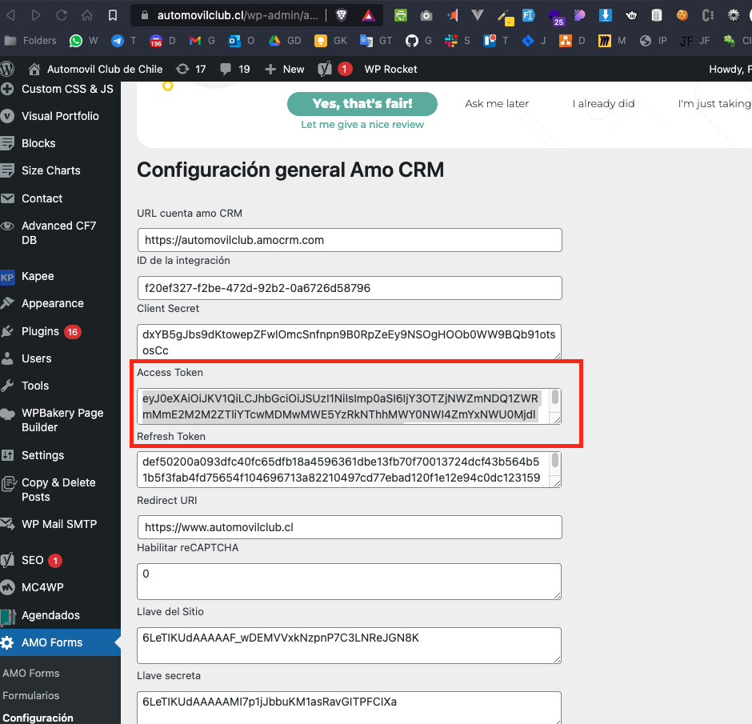

## ALERTA Aplicación en Desarrollo
### Aplicación para leer logs de Leads del plugin de AMO en la BBDD WordPress

### Instrucciones de instalación y compilado:

## Posterior a la clonación solo la primera vez realizar:
```
npm install
```

## Para compilar el JS con Babel para no tener problemas de compatibilidad usar:
```
npm run build
```

### IMPORTANTE: en ara obtener un token valido de AMO CRM, debemos ir al WordPress y extraer el Access Token desde ahí en la configuración del plugin AMO Forms, si es la primera vez que usas este plugin debes realizar el siguiente comando, recuerda que tambien debes ter tu IP pública configurada en la seguridad de la BBDD de Azure y configurar los accesos en el .env


```
cp .env.example .env
```


### Lo anterior es para crear crear las variables de entorno necesarias, dentro de esta se encuentra el ACCESS_TOKEN a configurar


## Una vez compilado se ejecuta con:
```
npm run start
```
