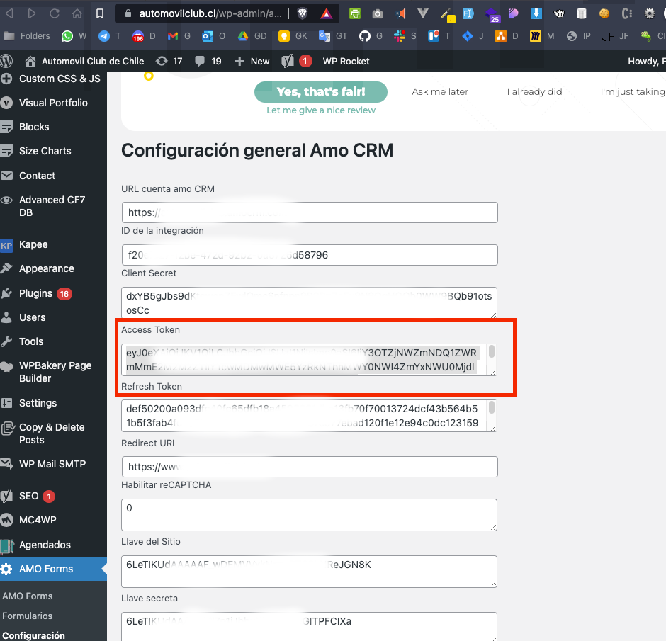

## ALERTA Aplicación en Desarrollo
### Aplicación para leer logs de Leads del plugin de AMO en la BBDD WordPress

### Instrucciones de instalación y compilado:

## Posterior a la clonación solo la primera vez realizar:
```
npm install
```

## Para compilar el JS con Babel para no tener problemas de compatibilidad usar:
```
npm run build
```

### IMPORTANTE: para obtener un token valido de AMO CRM, debemos ir al WordPress y extraer el Access Token desde ahí en la configuración del plugin AMO Forms, si es la primera vez que usas este plugin debes realizar el siguiente comando para crear el archivo con las variables de entorno, recuerda que tambien debes desbloquear tu IP pública configurada en la seguridad de la BBDD de Azure y configurar los accesos en el .env


```
cp .env.example .env
```


### Lo anterior es para crear las variables de entorno necesarias, dentro de esta se encuentra el ACCESS_TOKEN a configurar


## Con el siguiente comando el proyecto se compilara y se ejecutara de forma automatica:
```
npm run start
```

## Una vez ejecutado el proyecto mostrara tu IP PUBLICA en el caso que lo necesites para desbloquear el acceso a la BBDD de wordpres en azure. Para usarlo solo se te pedira la fecha desde cuando quieras revisar los leads, se creara un log en pantalla a tiempo real y al finalizar el proceso guardara todo en un archivo fecha-hora-log.txt en el proyecto, de esa forma podras ver en que fallaron algunos procesos.

